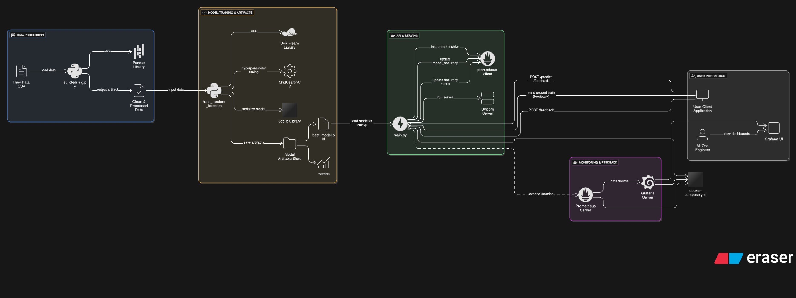

# Predictive Maintenance for Industrial Equipment using AWS ML Services

## Project Overview
This project implements an end-to-end Machine Learning pipeline for predicting equipment failures using IoT sensor data. The system processes real-time sensor data, trains ML models, and provides predictions to prevent equipment failures before they occur.

## Use Case: Predictive Maintenance for Industrial Equipment

Predictive maintenance leverages sensor data and machine learning to anticipate equipment failures before they occur. This approach minimizes downtime, reduces maintenance costs, and increases operational efficiency. In industrial settings, unplanned equipment failures can lead to significant financial losses and safety risks. By predicting failures in advance, organizations can schedule maintenance proactively, optimize spare parts inventory, and improve overall reliability.

## Why This Dataset?

We use a comprehensive predictive maintenance dataset inspired by real-world industrial telemetry, maintenance, and failure logs. The dataset merges:
- **Telemetry data:** Sensor readings (volt, rotate, pressure, vibration) at regular intervals
- **Failure logs:** Records of component failures (e.g., comp1, comp2)
- **Error logs:** Machine error events
- **Maintenance logs:** Preventive maintenance actions
- **Machine metadata:** Machine age and model

**Why this dataset?**
- **Realism:** Closely mimics actual industrial environments with multiple data sources
- **Richness:** Enables feature engineering, multi-source data fusion, and complex ML tasks
- **Benchmarking:** Aligns with popular Kaggle datasets, making results comparable and reproducible
- **Scalability:** Structure supports scaling to larger, real-world deployments

**Why only one merged file?**
- Simplifies ETL and modeling pipelines
- Reduces join/merge complexity
- Ensures all relevant features are available for each record

## Dataset Structure

The dataset (`data/predictive_maintenance_full.csv`) contains the following columns:
- `datetime`: Timestamp of the record
- `machineID`: Unique identifier for each machine
- `volt`: Voltage sensor reading
- `rotate`: Rotational speed sensor reading
- `pressure`: Pressure sensor reading
- `vibration`: Vibration sensor reading
- `errorID`: Error event identifier (if any)
- `failure`: Failure event/component (if any)
- `comp_maint`: Component maintained (if any)
- `age`: Age of the machine (in years)
- `model`: Machine model type

This structure enables both time-series and event-driven analysis, supporting advanced ML workflows.

## Architecture



### Why This Architecture?

This architecture is designed to be:
- **Scalable:** Uses AWS managed services (S3, Glue, SageMaker, etc.) that scale with data and compute needs
- **Modular:** Each stage (ETL, validation, modeling, deployment, monitoring) is decoupled for flexibility and maintainability
- **Secure:** Implements best practices for access control, encryption, and network isolation
- **Observable:** Integrates monitoring and logging at every stage for transparency and reliability
- **Industry-Standard:** Follows patterns used in real-world production ML systems

### Component Explanations

- **Data Ingestion:**
  - Data is sourced from industrial sensors (simulated here via the merged CSV) and ingested into the pipeline.
  - AWS Glue is used for ETL because it is serverless, scalable, and integrates natively with S3 and other AWS services.

- **Data Storage:**
  - Amazon S3 is chosen for its durability, scalability, and cost-effectiveness for both raw and processed data.

- **Orchestration & Validation:**
  - Apache Airflow orchestrates the workflow, enabling scheduling, dependency management, and monitoring of ETL and ML tasks.
  - Great Expectations is used for data validation, ensuring data quality and schema consistency before modeling.

- **Modeling:**
  - Amazon SageMaker is used for model training and deployment due to its managed infrastructure, built-in algorithms, and integration with the AWS ecosystem.
  - Amazon Bedrock is included for advanced feature engineering and leveraging large language models (LLMs) if needed.
  - Model Registry provides versioning and lifecycle management for trained models.

- **Deployment & Monitoring:**
  - SageMaker Endpoints serve the trained model for real-time inference.
  - API Gateway exposes the endpoint securely to client applications.
  - Prometheus and Grafana provide real-time monitoring and visualization of system and model metrics.
  - AWS CloudWatch is used for centralized logging and alerting.

- **Security:**
  - IAM manages fine-grained access control for all AWS resources.
  - KMS ensures encryption of data at rest and in transit.
  - Security Groups and VPC provide network isolation and firewalling.

### Why These Choices?
- **AWS Glue:** Serverless, easy to scale, and integrates with S3 and other AWS services.
- **S3:** Industry standard for data lakes, highly durable and cost-effective.
- **Airflow:** Open-source, flexible, and widely adopted for workflow orchestration.
- **Great Expectations:** Leading open-source tool for data validation and quality checks.
- **SageMaker:** End-to-end ML platform with managed training, deployment, and monitoring.
- **Prometheus & Grafana:** De facto open-source stack for metrics and dashboards.
- **CloudWatch:** Native AWS logging and alerting.
- **IAM/KMS/Security Groups/VPC:** Best practices for cloud security and compliance.

This architecture and dataset design ensure your predictive maintenance solution is robust, scalable, and ready for real-world deployment.

## Project Structure
```
predictive-maintenance/
├── data/                    # Data storage
├── notebooks/              # Jupyter notebooks
├── src/                    # Source code
│   ├── etl/               # ETL scripts
│   ├── validation/        # Data validation
│   ├── training/          # Model training
│   └── deployment/        # Deployment scripts
├── airflow/               # Airflow DAGs
├── docker/                # Docker configurations
├── monitoring/            # Prometheus & Grafana configs
└── docs/                  # Documentation
```

## Prerequisites
- AWS Account with appropriate permissions
- Docker installed
- Python 3.8+
- AWS CLI configured
- Apache Airflow
- Prometheus & Grafana

## Setup Instructions
1. Clone the repository
2. Install dependencies: `pip install -r requirements.txt`
3. Configure AWS credentials
4. Set up Docker containers
5. Initialize Airflow
6. Configure monitoring stack

## Step-by-Step Implementation
Each step will be documented in detail in the respective directories.

## Security Considerations
- Data encryption at rest and in transit
- IAM roles and policies
- VPC configuration
- Network security
- Access control
- Audit logging

## Monitoring & Metrics
- Model performance metrics
- System health metrics
- Resource utilization
- Cost monitoring
- Security metrics

## Contributing
Please read CONTRIBUTING.md for details on our code of conduct and the process for submitting pull requests.

## License
This project is licensed under the MIT License - see the LICENSE file for details. 